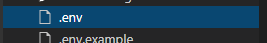
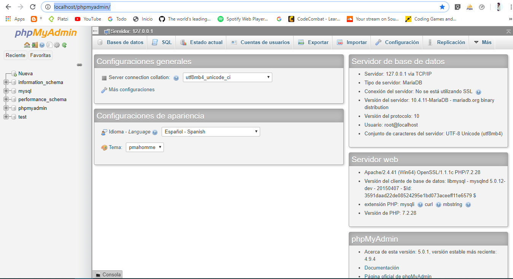
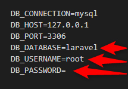
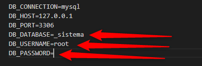

# 1. PRIMERO DEBES INSTALAR 

Instalar un servidor de aplicaciones Web Local:

En este proyecto vamos a utilizar XAMPP: que ya te incluye (php+apache+mysql)

Instalar Composer:
es un manejador de dependencias que nos va permitir trabajar con laravel
en especifico para instalar LARAVEL.

# 2. COMO CREAR UN PROYECTO NUEVO EN LARAVEL

Usa tu editor de texto favorito en este caso vamos a usar Visual Studio Code.
	desde el editor de texto ingresa a la carpeta:
	disco local C:/
	Ingresa a la carpeta XAAMP
	Ingresa a la carpeta htdocs
	Luego desde Visual Studio Code ingresa a la terminal y escribe el siguiente comando:

`$ composer create-project --prefer-dist laravel/laravel sistema`

# 3. Como conectar La Base de Datos y vamos a usar las migraciones de Laravel

Nos vamos a la extencion .env para configuar la Base de Datos

 abrimos nuestro navegador y nos dirigimos a PHPMyAdmin http://localhost/phpmyadmin/
 

Creamos una nueva base de datos 
y le damos un nombre

esta base de datos es la que vamos a ligar con mi proyecto de LARAVEL 

Nos dirigimos a la siguiente ubicación de la extencion .env y modificamos solo las partes seleccionadas

En la primera opcion le agregamos el nombre de la base de datos que creamos en phpmyadmin
en la segunda opcion agregamos root
en la tercera no agregamos contraseña

